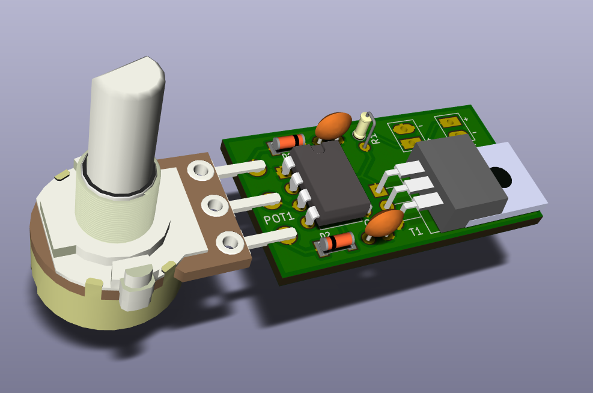

# LED DIMMER 12V

A pulse width modulation (PWM) LED Dimmer built around a 555 timer.
Designed for 12V+ power supply (but should work for 5V+) and using a CMOS transistor to support high power draw.

The 555 part is inspired by [this circuit](http://www.pcbheaven.com/circuitpages/LED_PWM_Dimmer/).

## Circuit

## Parts
- C1 is mandatory and should be small, 10nF works fine
- R1 should be as low a possible without drawing too much current from the 555. Higher values might limit the maximum brightness. R1 of 1k‎Ω to 10kΩ work fine.
- C2 is optional but it's cleaner to use it.
- Pot1 should be 10kΩ.

## Caveats
- At low brightness, the circuit is unstable. You need to turn the potentiometer a little before the leds light up. It's not smooth 0-100 duty cycle. I'm not sure how to improve this without using a very low R1 and risk frying the 555.
- At low brightness, R1 can heat quite a lot, use a properly power rated resitor.

## 3D Render of v1.1

## Picture of v1.0, with corrections applied to behave like v1.1

